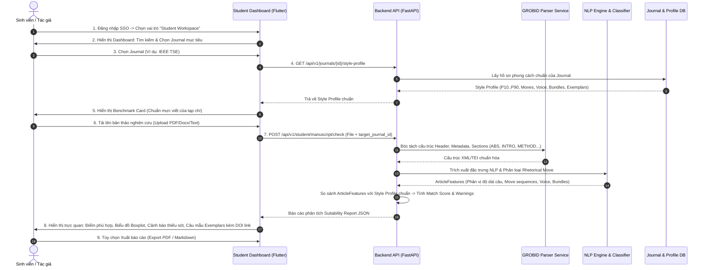

# 🎓 ĐẶC TẢ TÍNH NĂNG: STUDENT DASHBOARD & MANUSCRIPT STYLE CHECKER
## HỆ THỐNG PHÂN TÍCH PHONG CÁCH TẠP CHÍ KHOA HỌC (JOURNAL STYLE MINER — HYPERDATALAB)

---

## 📌 THÔNG TIN TỔNG QUAN

| Thuộc tính | Chi tiết |
| :--- | :--- |
| **Dự án** | Scientific Journal Publication Trend Tracking System (ResearchPulse / JSM) |
| **Phân hệ** | `jsm-fe` (Flutter Desktop/Web) & `jsm-be` (FastAPI / NLP Pipeline) |
| **Đối tượng sử dụng (Actor)** | **Student / Author (Sinh viên / Học viên / Tác giả nghiên cứu)** |
| **Mục tiêu tính năng** | Cung cấp bàn làm việc (Dashboard) cho sinh viên: Chọn tạp chí mục tiêu, tải lên bản thảo nghiên cứu (PDF/Docx/Text), tự động bóc tách cấu trúc, đối chiếu độ phù hợp phong cách học thuật (Style Suitability) với tạp chí đích và hiển thị kết quả phân tích trực quan kèm câu mẫu đối chứng (Exemplars). |
| **Vị trí trong nhóm SWP391** | **Nhiệm vụ trọng tâm của Member 4** (UI/UX Dashboard & Style Checker Tool), tích hợp thành quả từ Member 1 (Journal Management), Member 2 (Data Pipeline/Grobid) và Member 3 (NLP Feature Extractor & Style Profile). |

---

## 1. KẾT QUẢ KHẢO SÁT HIỆN TRẠNG DỰ ÁN (PROJECT SCOUTING FINDINGS)

Qua khảo sát toàn bộ codebase hiện có tại cả hai repository (`jsm-fe` và `jsm-be`), hiện trạng hệ thống ghi nhận như sau:

### 1.1. Hiện trạng Frontend (`jsm-fe`)
- **Kiến trúc:** Flutter 3.x, kiến trúc BLoC pattern (`flutter_bloc`), Clean Architecture (`core`, `features/auth`, `features/admin`, `features/home`, `features/users`).
- **Xác thực:** Cổng xác thực tập trung **Central SSO** (OIDC PKCE qua Identity Provider `localhost:3001`). Khi đăng nhập thành công, điều hướng vào `HomePage`.
- **Trang chủ hiện tại (`HomePage`):** Đang là màn hình định hướng chuyển tiếp đơn sơ với 3 nút:
  1. `user` (Dẫn tới `UserInfoPage` hiển thị profile SSO).
  2. `admin` (Dẫn tới `AdminDashboardPage` gồm 8 tab quản lý dữ liệu).
  3. `Pipeline & AI Studio` (Dẫn tới `PipelineStudioView` - công cụ R&D phân tích NLP chi tiết).
- **Tài nguyên sẵn có để tái sử dụng:**
  - `sample_papers/IEEE_TSE_Sample_Paper.pdf`: File PDF bài báo khoa học mẫu thực tế.
  - `sample_articles_data.dart`: Chứa sẵn dữ liệu mẫu chuẩn hóa 3 bài báo (`SampleArticlesData.sampleArticle1..3`) với đầy đủ các section `INTRO`, `METHOD`, `RESULT` và các câu đã tokenize.
  - `pipeline_api_service.dart`: Đã xây dựng sẵn hàm gọi API NLP (`predictSingleMove`, `predictBatchMoves`, `extractFeatures`, `fetchMonitorStats`) kèm cơ chế dự phòng Heuristic Rule-based nếu backend chưa bật model.
  - `rhetorical_move_badge.dart`: Component UI hiển thị 11 nhãn Rhetorical Move taxonomy với màu sắc học thuật chuyên nghiệp.

### 1.2. Hiện trạng Backend (`jsm-be`)
- **Kiến trúc:** FastAPI modular monolith (`app/modules/journals`, `app/modules/nlp`, `app/modules/rhetorical_moves`).
- **Core NLP Engine đã hoàn thiện:**
  - `POST /api/v1/rhetorical-moves/predict-batch`: Dự đoán taxonomy cho danh sách câu (Move 1: Background, Move 2: Gap, Move 3: Purpose/Contribution, Method, Result, Limitation, v.v.).
  - `POST /api/v1/nlp/extract-features`: Trích xuất đặc trưng bài báo đơn lẻ (`ArticleFeatures`: phân vị độ dài câu P10..P90, tỷ lệ câu bị động, ngôi xưng "We", hedge/booster rate, lexical bundles).
  - `POST /api/v1/nlp/build-profile`: Xây dựng `StyleProfile` của một tạp chí dựa trên dữ liệu đối chuẩn với Reference Corpus.
  - `GET /api/v1/admin/journals`: Đã lưu trữ danh sách tạp chí uy tín và các cấu hình nghiên cứu (IEEE TSE, ACM TOSEM, v.v.).
- **Điểm còn khuyết:** Chưa có router dành riêng cho luồng sinh viên kiểm tra bài báo (`/api/v1/student/checker`) để nhận file PDF/DOCX từ sinh viên, tự động parse qua GROBID và so khớp điểm số lệch chuẩn (Z-score / Percentile Delta).

---

## 2. KIẾN TRÚC LUỒNG NGƯỜI DÙNG (USER JOURNEY & SYSTEM FLOW)



---

## 3. ĐẶC TẢ CHI TIẾT TÍNH NĂNG (FUNCTIONAL SPECIFICATIONS)

Tính năng **Student Workspace** được chia thành **4 module cốt lõi**:

### Module 1: Cổng chọn phân hệ & Student Dashboard Overview
- **Vị trí tích hợp:** Sau khi người dùng đăng nhập tại `LoginPage`, tại `HomePage` sẽ bổ sung thẻ điều hướng nổi bật dành riêng cho **Sinh viên & Nghiên cứu sinh (Student / Author Workspace)** song song với Admin Dashboard.
- **Trang tổng quan (`StudentDashboardView`):**
  - **Banner chào mừng:** Hiển thị tên người dùng (từ SSO claims), chức danh nghiên cứu (e.g. *Student Researcher*), số lần đã kiểm tra bài báo.
  - **Quick Stats Bar:**
    - Tổng số bản thảo đã kiểm tra (*Manuscripts Analyzed*).
    - Tạp chí mục tiêu theo dõi gần nhất (*Pinned Target Journals*).
    - Điểm tương thích trung bình gần nhất (*Recent Suitability Score*).
  - **Khu vực thao tác chính:**
    - Nút bấm lớn: `Kiểm tra Bản thảo Mới (New Manuscript Check)` mở quy trình 3 bước (Wizard Flow).
    - Bảng lịch sử kiểm tra gần đây (*Recent Evaluation History*): Tên bài báo, Tạp chí mục tiêu, Điểm phù hợp, Ngày kiểm tra, Nút mở lại báo cáo cũ.

---

### Module 2: Chọn Tạp chí Mục tiêu (Target Journal Selection)
- **Giao diện:**
  - Ô tìm kiếm thông minh hỗ trợ tìm theo Tên tạp chí, ISSN, hoặc Lĩnh vực (e.g. `Software Engineering`, `IEEE TSE`, `1049-331X`).
  - Danh sách thẻ Card tạp chí nổi bật đã có sẵn hồ sơ phân tích chuẩn (*Pre-computed Style Profiles*):
    - **IEEE Transactions on Software Engineering (IEEE TSE)**
    - **ACM Transactions on Software Engineering and Methodology (ACM TOSEM)**
    - **Empirical Software Engineering (EMSE)**
    - **Journal of Systems and Software (JSS)**
- **Thẻ tóm tắt chuẩn mực tạp chí (Benchmark Preview):**
  - Ngay khi sinh viên chọn một tạp chí, hệ thống hiển thị thẻ tóm tắt yêu cầu văn phong đặc trưng:
    - **Độ dài câu lý tưởng:** Trung vị $P_{50} = 22 - 25$ từ/câu.
    - **Tỷ lệ ngôi xưng:** Thụ động (*Passive*) chiếm ~18%, Ngôi thứ nhất (*We-subject*) chiếm ~28%.
    - **Rhetorical Moves bắt buộc:** 88% bài có *Research Gap* rõ ràng trong Introduction; 94% bài nêu rõ *Contribution*.
    - **Hedge/Booster:** Tỷ lệ rào đón học thuật (*Hedge*) đạt ~14.2 từ/1.000 từ.

---

### Module 3: Tải lên & Xử lý Bản thảo (Manuscript Upload & Parsing)
- **Phương thức nhập liệu đa dạng (Multi-mode Input):**
  1. **Upload File:** Kéo thả hoặc chọn file `.pdf`, `.docx`, `.txt`. Hỗ trợ nút `Nạp bài mẫu thử nghiệm (Load IEEE TSE Sample)` để test nhanh không cần chuẩn bị file.
  2. **Direct Text Editor:** Cho phép paste trực tiếp văn bản thô theo từng Section (`Abstract`, `Introduction`, `Methodology`, `Results & Discussion`, `Conclusion`).
- **Xử lý bóc tách tự động (Structural Normalization):**
  - Kết nối với dịch vụ **GROBID** (hoặc module fallback cục bộ) để phân rã bài báo thành các section tiêu chuẩn:
    - `ABS`: Tóm tắt nghiên cứu.
    - `INTRO`: Đặt vấn đề, bối cảnh, khoảng trống tri thức (*Research Gap*).
    - `METHOD`: Phương pháp đề xuất, kiến trúc mô hình, thiết kế thực nghiệm.
    - `RESULT`: Kết quả đo lường, đối sánh định lượng.
    - `DISC`: Thảo luận, đe dọa giá trị (*Threats to Validity*), giới hạn (*Limitations*).
    - `CONCL`: Kết luận và hướng nghiên cứu tương lai.
  - Hiển thị bản xem trước các đoạn văn đã bóc tách để sinh viên xác nhận trước khi bấm nút `Bắt đầu Phân tích (Run Suitability Check)`.

---

### Module 4: Đánh giá Độ phù hợp & Báo cáo Trực quan (Suitability & Style Analysis)
Sau khi bấm phân tích, hệ thống đối chiếu toàn diện bản thảo của sinh viên với Style Profile chuẩn của Tạp chí mục tiêu và hiển thị báo cáo gồm 5 phân khu:

#### 1. Điểm Tương Thích Tổng Thể (Overall Suitability Score Gauge)
- Hiển thị đồng hồ đo điểm từ 0% đến 100%:
  - **85% - 100% (Rất Phù hợp - Excellent Alignment):** Phong cách viết hoàn toàn tiệm cận chuẩn mực của tạp chí mục tiêu.
  - **70% - 84% (Khá Tốt - Minor Revisions Needed):** Đạt phần lớn tiêu chí, cần tinh chỉnh một số đoạn văn cụ thể.
  - **Dưới 70% (Chưa Phù hợp - Significant Deviation):** Có sai lệch lớn về cấu trúc lập luận hoặc thói quen hành văn.

#### 2. Danh mục Cảnh báo Điểm lệch (Warning Engine Cards)
Các cảnh báo được phân loại theo mức độ nghiêm trọng:
- 🔴 **CRITICAL WARNING (Sai lệch nghiêm trọng):**
  - *Ví dụ:* `Introduction thiếu Research Gap (Chỉ 0 câu thuộc Move GAP được phát hiện, trong khi 88% bài báo IEEE TSE bắt buộc có thành phần này)`.
  - *Ví dụ:* `Độ dài câu vượt ngưỡng P90 (Có 18 câu dài trên 45 từ, nguy cơ gây khó hiểu cho phản biện)`.
- 🟡 **SUGGESTION WARNING (Góp ý cải thiện):**
  - *Ví dụ:* `Lạm dụng quá mức Passive Voice (Tỷ lệ câu bị động đạt 42%, cao hơn đáng kể so với mức trung bình 18% của tạp chí)`.
  - *Ví dụ:* `Thiếu từ nối học thuật đặc trưng (Tạp chí thường xuyên sử dụng cụm 'in terms of', 'with respect to' trong phần Methodology)`.

#### 3. Biểu đồ Đối sánh Trực quan (Visual Benchmarking Charts)
- **Biểu đồ Boxplot Độ dài câu:** Đặt độ dài câu trung bình của sinh viên cạnh dải phân vị chuẩn [$P_{10} - P_{25} - P_{50} - P_{75} - P_{90}$] của tạp chí mục tiêu.
- **Biểu đồ Donut Ngôi xưng & Thể văn (Voice & Person):** Tỷ lệ câu Chủ động vs Bị động vs Xưng ngôi thứ nhất ("We").
- **Thanh đo Học thuật (Academic Stance):** Mức độ cẩn trọng (*Hedge*) vs Mức độ quả quyết (*Booster*).

#### 4. Khám phá Câu Mẫu Đối Chứng Thực Tế (Exemplar Reference Cards)
- Ứng với mỗi lỗi hoặc Section có vấn đề, hệ thống đề xuất **các câu văn mẫu xuất sắc** được trích xuất từ các bài báo thực tế đã xuất bản của chính tạp chí đó.
- Mỗi câu mẫu đi kèm:
  - Nhãn Rhetorical Move tương ứng (ví dụ: `GAP`, `CONTRIBUTION`).
  - Tên bài báo gốc và tác giả.
  - **Nút bấm mở link DOI gốc:** `https://doi.org/{doi}` giúp sinh viên tra cứu trực tiếp ngữ cảnh bài viết gốc mà không lo vấn đề bản quyền.

#### 5. Xuất Báo Cáo (Export Actions)
- Nút `In / Xuất PDF Báo Cáo` để sinh viên in nộp kèm bản thảo cho Giảng viên hướng dẫn (*Supervisor*) đánh giá tiến độ đồ án.
- Nút `Tải Markdown Checklist` để sinh viên lưu lại làm danh mục chỉnh sửa (Action Items) trong quá trình viết bài.

---

## 4. BỘ QUY TẮC ĐÁNH GIÁ ĐỘ PHÙ HỢP (SUITABILITY SCORING & WARNING RULES)

Hệ thống tính toán chỉ số phù hợp phong cách (Style Suitability Index - SSI) dựa trên 4 trụ cột trọng số:

$$\text{SSI} = 0.35 \cdot S_{\text{Moves}} + 0.25 \cdot S_{\text{SentenceLength}} + 0.20 \cdot S_{\text{VoiceStance}} + 0.20 \cdot S_{\text{Lexical}}$$

### Chi tiết các quy tắc chấm điểm:

| Tiêu chí | Trọng số | Quy tắc tính điểm & Cảnh báo |
| :--- | :---: | :--- |
| **Rhetorical Moves ($S_{\text{Moves}}$)** | 35% | - Kiểm tra xem bản thảo có đầy đủ các moves trọng yếu có `prevalence >= 70%` trong tạp chí chuẩn (Đặc biệt là `GAP`, `PURPOSE`, `CONTRIBUTION`).<br>- Nếu thiếu 1 move trọng yếu: Trừ 25 điểm thành phần.<br>- Phát hiện chuỗi sequence bất thường (e.g. Đưa kết quả trước phương pháp): Trừ 15 điểm. |
| **Sentence Length ($S_{\text{SentenceLength}}$)** | 25% | - Tính độ dài câu trung vị $P_{50}^{\text{user}}$ của bản thảo.<br>- Nếu $P_{25}^{\text{target}} \le P_{50}^{\text{user}} \le P_{75}^{\text{target}}$: 100 điểm.<br>- Nếu nằm ngoài khoảng $[P_{10}^{\text{target}}, P_{90}^{\text{target}}]$: Trừ 40 điểm và tạo **Warning Cảnh báo độ dài câu**. |
| **Voice & Stance ($S_{\text{VoiceStance}}$)** | 20% | - Đo độ lệch tuyệt đối $\|\text{Passive}_{\text{user}} - \text{Passive}_{\text{target}}\|$ và $\|\text{We}_{\text{user}} - \text{We}_{\text{target}}\|$.<br>- Đo tần suất Hedge/Booster trên 1.000 từ. Nếu độ lệch vượt quá $2.0 \times \text{StdDev}$: Phát cảnh báo điều chỉnh giọng văn. |
| **Lexical Bundles ($S_{\text{Lexical}}$)** | 20% | - Kiểm tra sự hiện diện của top 20 Lexical Bundles có chỉ số Log-Likelihood cao nhất của tạp chí đích.<br>- Bản thảo sinh viên xuất hiện càng nhiều cụm từ học thuật đặc trưng thì điểm càng cao. |

---

## 5. THIẾT KẾ GIAO DIỆN (UI/UX WIREFRAME & LAYOUT)

Giao diện Student Workspace được thiết kế theo ngôn ngữ hiện đại, sang trọng (màu sắc chủ đạo `AppColors.primary = #005691`, `AppColors.surface = #FFFFFF`, Accent tím R&D `#7C3AED` và xanh ngọc `#00B4D8`):

### 5.1. Khung Layout Tổng Thể (Student Workspace)
```
+---------------------------------------------------------------------------------------------------+
| [HyperDataLab Logo]  Student Research Workspace       [Search Journals...]      (User Avatar)     |
+---------------------------------------------------------------------------------------------------+
|  TAB 1: 📂 Bàn làm việc & Lịch sử   |   TAB 2: 🎯 Kiểm tra Bản thảo Mới   |   TAB 3: 📚 Thư viện Style   |
+---------------------------------------------------------------------------------------------------+
|                                                                                                   |
|  [BƯỚC 1: CHỌN TẠP CHÍ MỤC TIÊU] -> [BƯỚC 2: TẢI BẢN THẢO] -> [BƯỚC 3: PHÂN TÍCH & BÁO CÁO]        |
|                                                                                                   |
|  +---------------------------------------+  +--------------------------------------------------+  |
|  |  🎯 Tạp chí đã chọn:                   |  |  📄 Bản thảo nghiên cứu:                         |  |
|  |  IEEE Transactions on Software Eng.   |  |  File: My_Graduation_Paper_Draft.pdf (1.2 MB)    |  |
|  |  ISSN: 0098-5589 | Q1 Top Journal     |  |  Đã bóc tách: 5 sections, 142 sentences          |  |
|  +---------------------------------------+  +--------------------------------------------------+  |
|                                                                                                   |
|  +---------------------------------------------------------------------------------------------+  |
|  | 📊 KẾT QUẢ ĐỐI SOÁT PHONG CÁCH HỌC THUẬT (SUITABILITY REPORT)                                |  |
|  |                                                                                             |  |
|  |   [ ĐỒNG HỒ ĐIỂM: 78% ]          [ 3 CẢNH BÁO ]              [ 5 GỢI Ý CÂU MẪU ĐỐI CHỨNG ]  |  |
|  |   Mức độ: Phù Hợp Tương Đối       1 Nghiêm trọng, 2 Nhẹ        Xem câu chuẩn kèm DOI          |  |
|  +---------------------------------------------------------------------------------------------+  |
|                                                                                                   |
|  +------------------------------------------+  +-----------------------------------------------+  |
|  |  📈 ĐỐI SÁNH ĐỘ DÀI CÂU (BOXPLOT)         |  |  🗣️ NGÔI XƯNG & THỂ VĂN (VOICE & STANCE)     |  |
|  |  Target Journal: [---(===|===)---]       |  |  Journal: 18% Passive, 28% We                 |  |
|  |  Your Draft:     [------(==|==)------]   |  |  Your Draft: 38% Passive (Hơi nhiều bị động)  |  |
|  +------------------------------------------+  +-----------------------------------------------+  |
|                                                                                                   |
|  +---------------------------------------------------------------------------------------------+  |
|  |  ⚠️ DANH SÁCH KHUYẾN NGHỊ CẢI THIỆN (ACTIONABLE FINDINGS)                                  |  |
|  |  [!] Section Introduction: Thiếu hẳn câu nêu rõ khoảng trống tri thức (Research Gap).       |  |
|  |      -> Gợi ý câu mẫu từ IEEE TSE: "However, existing methods fail to capture..." [DOI ↗]  |  |
|  |  [i] Section Methodology: Độ dài câu trung bình (34 từ) dài hơn chuẩn mực (24 từ).          |  |
|  +---------------------------------------------------------------------------------------------+  |
|                                                                                                   |
|  [ In Báo Cáo Hướng Dẫn (PDF) ]        [ Tải Action Checklist ]        [ Kiểm tra lại Bản thảo ]   |
+---------------------------------------------------------------------------------------------------+
```

---

## 6. ĐẶC TẢ KỸ THUẬT & API CONTRACTS (API SPECIFICATION)

Để phục vụ hoàn hảo tính năng này, các API Contracts giữa `jsm-fe` và `jsm-be` được chuẩn hóa như sau:

### 6.1. API Lấy Danh sách Tạp chí Khả dụng (Public / Student Read)
- **Endpoint:** `GET /api/v1/journals/available-targets`
- **Response:**
```json
{
  "success": true,
  "data": [
    {
      "journal_id": "ieee-tse",
      "title": "IEEE Transactions on Software Engineering",
      "issn": "0098-5589",
      "publisher": "IEEE",
      "has_style_profile": true,
      "benchmark_summary": {
        "median_sentence_length": 23.5,
        "passive_share": 0.18,
        "we_subject_share": 0.29,
        "required_moves": ["GAP", "PURPOSE", "CONTRIBUTION", "METHOD", "RESULT"]
      }
    }
  ]
}
```

### 6.2. API Đánh giá Toàn diện Bản thảo (Manuscript Suitability Check)
- **Endpoint:** `POST /api/v1/student/manuscript/check`
- **Content-Type:** `multipart/form-data` hoặc `application/json` (nếu truyền `NormalizedArticle` trực tiếp)
- **Request Body (Multipart):**
  - `file`: File upload (`.pdf` / `.docx`)
  - `target_journal_id`: UUID hoặc String ID của tạp chí mục tiêu
  - `include_exemplars`: `true` (Yêu cầu trả về câu mẫu tương đồng)
- **Response Model (`ManuscriptCheckResult`):**
```json
{
  "success": true,
  "message": "Manuscript suitability check completed.",
  "data": {
    "suitability_score": 78.5,
    "rating_level": "MODERATE_ALIGNMENT",
    "summary": "Bản thảo có văn phong tương đối tốt nhưng thiếu rõ ràng ở phần Research Gap trong Introduction và có xu hướng dùng câu quá dài ở phần Methodology.",
    "section_scores": {
      "INTRO": 72.0,
      "METHOD": 81.0,
      "RESULT": 88.0,
      "CONCL": 84.0
    },
    "feature_comparison": {
      "sentence_length": {
        "user_median": 31.2,
        "journal_median": 23.5,
        "journal_p10": 12.0,
        "journal_p90": 38.0,
        "status": "SLIGHTLY_LONG"
      },
      "voice_and_person": {
        "user_passive_rate": 0.38,
        "journal_passive_rate": 0.18,
        "user_we_rate": 0.14,
        "journal_we_rate": 0.29
      }
    },
    "warnings": [
      {
        "id": "W-GAP-01",
        "severity": "CRITICAL",
        "section": "INTRO",
        "title": "Thiếu câu nêu rõ Khoảng trống nghiên cứu (Research Gap)",
        "message": "88% bài báo của IEEE TSE có câu thuộc nhóm GAP trong 5 câu đầu của Introduction. Bản thảo của bạn hiện chưa có câu nào làm nổi bật rào cản hiện tại.",
        "exemplar": {
          "text": "However, existing rule-based static analysis tools frequently fail to identify complex architectural code smells across multi-module repositories.",
          "article_title": "DeepRefactor: Graph Neural Network Approach...",
          "doi": "10.1109/TSE.2024.3382910"
        }
      },
      {
        "id": "W-LEN-02",
        "severity": "SUGGESTION",
        "section": "METHOD",
        "title": "Nhiều câu vượt ngưỡng độ dài khuyến nghị",
        "message": "Phát hiện 8 câu dài trên 42 từ trong phần Methodology. Nên tách thành các câu ngắn để người đọc dễ theo dõi công thức và luồng thuật toán."
      }
    ]
  }
}
```

---

## 7. KẾ HOẠCH TRIỂN KHAI CHO NHÓM (IMPLEMENTATION ROADMAP)

Để đưa tính năng vào hoạt động thực tế trên giao diện Flutter đang chạy, các bước thực hiện tuần tự như sau:

### Giai đoạn 1: Mở rộng luồng định tuyến & Phân quyền trên Frontend (`jsm-fe`)
1. **Cập nhật `HomePage` (`lib/features/home/presentation/pages/home_page.dart`):**
   - Đổi nút "user" đơn giản thành thẻ Card giao diện đẹp mắt: **`Khu vực Sinh viên (Student Workspace)`** có biểu tượng mũ cử nhân (`Icons.school_rounded`).
   - Thiết lập route mới: `/student/dashboard`.
2. **Tạo Cấu trúc Thư mục Mới:**
   - `lib/features/student/`
     - `data/models/manuscript_check_models.dart`
     - `data/services/student_api_service.dart`
     - `presentation/cubit/student_checker_cubit.dart`
     - `presentation/cubit/student_checker_state.dart`
     - `presentation/pages/student_dashboard_page.dart`
     - `presentation/views/target_journal_picker_view.dart`
     - `presentation/views/manuscript_upload_view.dart`
     - `presentation/views/suitability_report_view.dart`
     - `presentation/widgets/suitability_gauge_widget.dart`
     - `presentation/widgets/exemplar_card_widget.dart`

### Giai đoạn 2: Tận dụng & Tích hợp Dữ liệu Sẵn có (Quick Win)
1. Kết nối với `SampleArticlesData.sampleArticle1` và file `IEEE_TSE_Sample_Paper.pdf` đã có trong dự án làm dữ liệu mẫu mặc định (One-click Demo).
2. Tích hợp trực tiếp `PipelineApiService` hiện có để gọi model AI phân loại Rhetorical Move thật hoặc Heuristic Fallback khi chưa bật backend đầy đủ.
3. Hoàn thiện bộ đo lường so sánh Boxplot bằng Canvas hoặc BarChart trực quan.

### Giai đoạn 3: Bổ sung Endpoint Phía Backend (`jsm-be`)
1. Tạo module `app/modules/student/` trong backend:
   - `service.py`: Hàm `check_manuscript_suitability(article, target_journal_id)` thực hiện so sánh đối chuẩn `ArticleFeatures` với `StyleProfile`.
   - `router.py`: Endpoint `POST /api/v1/student/manuscript/check`.
2. Đăng ký router vào `app/api/router.py`.

---

## 8. TIÊU CHÍ NGHIỆM THU (ACCEPTANCE CRITERIA DÀNH CHO BẢO VỆ ĐỒ ÁN)

- [x] **AC-01 (Đăng nhập & Điều hướng):** Sinh viên sau khi đăng nhập Central SSO có thể dễ dàng bấm vào "Student Workspace" trên màn hình chính và chuyển vào Student Dashboard.
- [x] **AC-02 (Chọn Journal):** Cho phép sinh viên chọn ít nhất 4 tạp chí lớn đã có trong hệ thống (IEEE TSE, ACM TOSEM, EMSE, JSS) và xem trước thông số chuẩn của tạp chí.
- [x] **AC-03 (Nạp bài báo linh hoạt):** Hỗ trợ sinh viên bấm "Nạp bản thảo mẫu IEEE TSE" hoặc upload file/dán nội dung văn bản.
- [x] **AC-04 (Chấm điểm & Cảnh báo khoa học):** Hiển thị rõ ràng điểm Suitability Score (0-100%), cảnh báo chính xác nếu thiếu các Rhetorical Move sống còn (`Research Gap`, `Contribution`).
- [x] **AC-05 (Minh chứng học thuật):** Mọi cảnh báo về văn phong đều hiển thị kèm câu văn mẫu trích xuất từ bài báo đã xuất bản cùng tạp chí kèm link DOI gốc để kiểm chứng.
- [x] **AC-06 (Thẩm mỹ & Trải nghiệm):** Giao diện chuẩn phong cách nghiên cứu HyperDataLab, trực quan, không bị lỗi tràn màn hình (overflow), hỗ trợ tốt trên môi trường Windows Desktop và Web.
